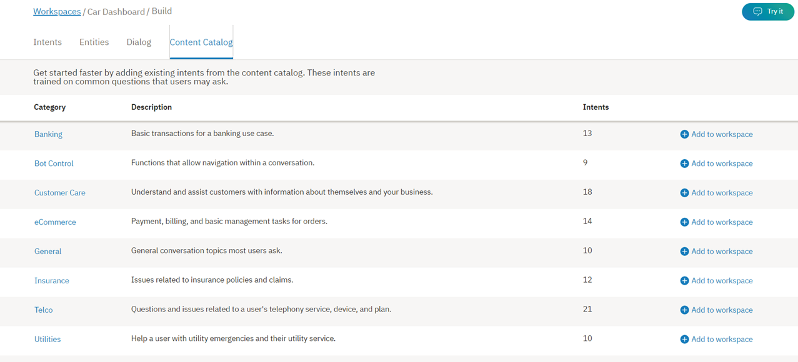
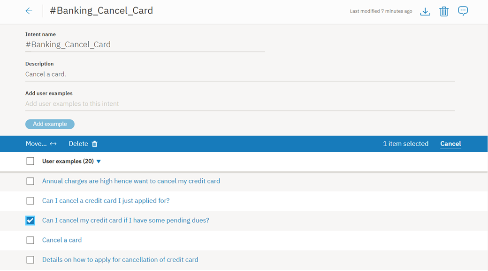

---

copyright:
  years: 2015, 2018
lastupdated: "2018-02-15"

---

{:shortdesc: .shortdesc}
{:new_window: target="_blank"}
{:tip: .tip}
{:pre: .pre}
{:codeblock: .codeblock}
{:screen: .screen}
{:javascript: .ph data-hd-programlang='javascript'}
{:java: .ph data-hd-programlang='java'}
{:python: .ph data-hd-programlang='python'}
{:swift: .ph data-hd-programlang='swift'}

# Using catalogs

***Catalogs*** provide an easy way to add common intents to your {{site.data.keyword.conversationshort}} service workspace.
{: shortdesc}

## Adding a catalog to your workspace
{: #add-catalog}

Use the {{site.data.keyword.conversationshort}} tool to add catalogs.

1.  In the {{site.data.keyword.conversationshort}} tool, open your workspace and then select the **Catalog** tab in the navigation bar. If **Catalog** is not visible, use the  menu to open the page.

1.  Select a catalog, such as *Billing*, to see the intents that are provided with it.

    

    You will see information about the intents that are defined in the *Billing* category.

    

    Intents that are added from a catalog are distinguishable from other intents by their naming convention; in this case, `#Billing_ . . .`

1.  Select  to return to the **Catalog** tab.

1.  Next, add the *Billing* catalog to your workspace by clicking the `Add to Bot` button. You will see a message indicating that the *Billing* intents have been added to your workspace.

    

1.  Now, select the **Intents** tab, and verify that the *Billing* intents have been added to your workspace.

    

### Results

The intents from the *Billing* catalog have been added to the **Intents** tab of your workspace, and the system begins to train itself on the new data.

## Editing catalog examples

Like any other intent, once the *Billing* catalog intents have been added to your workspace, you can make the following changes:

- Rename the intent.
- Delete the intent.
- Add, edit, or delete examples.
- Move an example to a different intent.

You can tab from the intent name to each example, editing the examples if you choose.

To move or delete an example, select the example by selecting the check box and then select **Move** or **Delete**.

  
